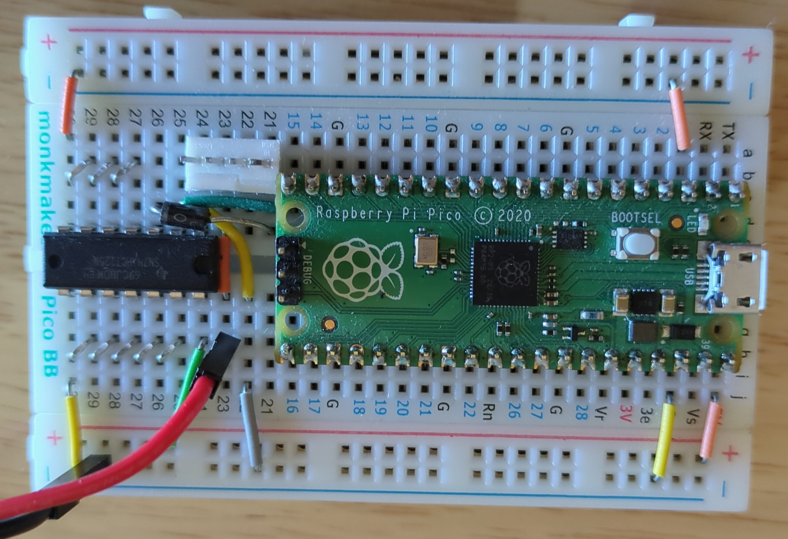
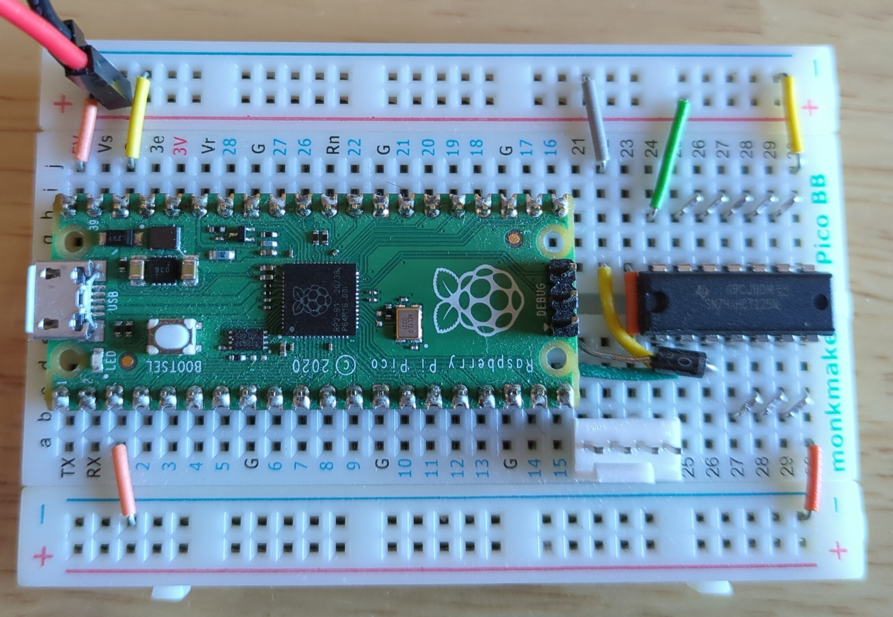
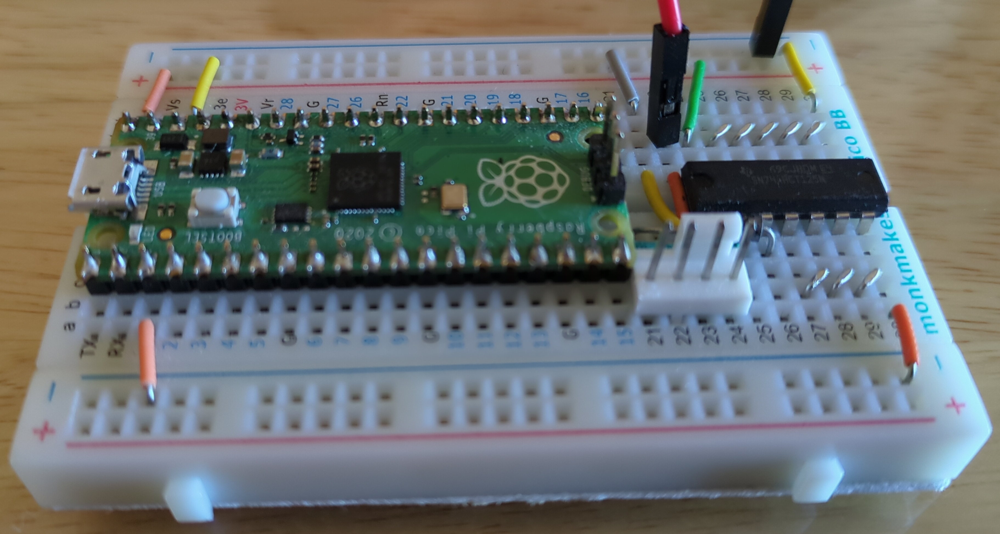
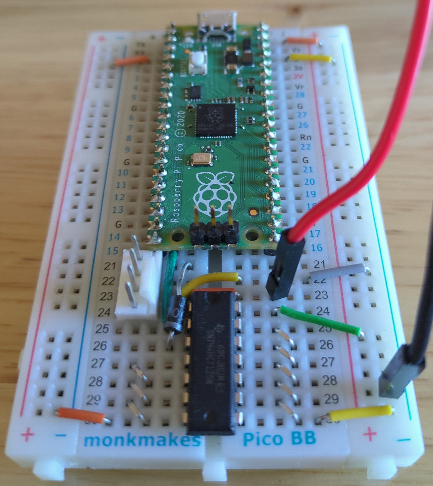
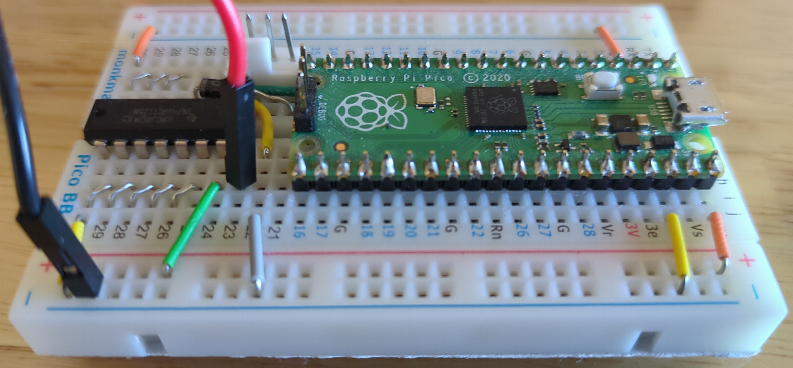

= PWM Fan Controller MicroPython
Jordan Williams <jordan@jwillikers.com>
:experimental:
:icons: font
ifdef::env-github[]
:tip-caption: :bulb:
:note-caption: :information_source:
:important-caption: :heavy_exclamation_mark:
:caution-caption: :fire:
:warning-caption: :warning:
endif::[]
:Asciidoctor_: https://asciidoctor.org/[Asciidoctor]
:just: https://github.com/casey/just[just]
:Linux: https://www.linuxfoundation.org/[Linux]
:MicroPython: https://micropython.org/[MicroPython]
:nix: https://nixos.org/[Nix]
:nix-direnv: https://github.com/nix-community/nix-direnv[nix-direnv]
:Noctua-NF-P12-redux-1700-PWM-Fan: https://noctua.at/en/nf-p12-redux-1700-pwm[Noctua NF-P12 redux-1700 PWM Fan]
:pip-tools: https://github.com/jazzband/pip-tools[pip-tools]
:pre-commit: https://github.com/nix-community/nixpkgs-update[pre-commit]
:Python: https://www.python.org/[Python]
:Raspberry-Pi-Pico: https://www.raspberrypi.com/products/raspberry-pi-pico/[Raspberry Pi Pico]

image:https://img.shields.io/endpoint?url=https://raw.githubusercontent.com/astral-sh/ruff/main/assets/badge/v2.json[Ruff, link=https://github.com/astral-sh/ruff]

A simple PWM fan controller for the {Raspberry-Pi-Pico}, written in {MicroPython}.

ifdef::env-github[]
++++

  

  

  

  

  

++++
endif::[]

ifndef::env-github[]

endif::[]

== Hardware

All the hardware components in my particular build are enumerated here.

.Fan Controller Components
* https://www.adafruit.com/product/798[12V DC 1000mA (1A) regulated switching power adapter - UL listed]
* https://www.digikey.com/en/products/detail/onsemi/1N4001RLG/918017[1N4001 Power Blocking Diode]
* https://www.digikey.com/en/products/detail/molex/0470533000/3262217[4-Pin Male Fan Header]
* https://www.digikey.com/en/products/detail/texas-instruments/SN74AHCT125N/375798[74AHCT125 - Quad Level-Shifter]
* https://www.adafruit.com/product/368[Female DC Power adapter - 2.1mm jack to screw terminal block]
* https://www.adafruit.com/product/64[Half-size breadboard]
* https://www.adafruit.com/product/1311[Hook-up Wire - 22AWG Solid Core]
* micro USB Power Supply for the microcontroller
* {Raspberry-Pi-Pico}
* https://www.adafruit.com/product/759[Premium Male/Male Jumper Wires - 40 x 3" (75mm)]

Programming will require a micro USB cable and a computer.
If you don't already have one, you'll probably want a fan, too.
This circuit is meant for a 12V fan.
I use this controller for the {Noctua-NF-P12-redux-1700-PWM-Fan}.

== How it Works

This is a dead-simple PWM fan controller that simply lowers the speed of the {Noctua-NF-P12-redux-1700-PWM-Fan} to a quiet 40%.
The microcontroller simply sets the fan speed and then does nothing.
The fan setup might evolve in the future to take into account temperature sensing and dynamic speed adjustment.

The 3.3V microcontroller used here requires a logic level shifter to boost the PWM signal up to 5V for the fan.
I use the 74AHCT125 to perform the logic level conversion, using pin #40, `VBUS`, to provide the 5V reference voltage.

The Raspberry Pi Pico only draws 8.63 mA of power now that the firmware is taking advantage of the light sleep mode.
If you're concerned about power usage or type safety, then you might be interested in my Rust-based implementation, https://github.com/jwillikers/PWM-Fan-Controller[PWM Fan Controller].
The Rust-based version still sips a bit less power on the Pico, 1.99 mA.
This is probably mostly due to the fact that the Rust-based version runs entirely off the low-power Ring Oscillator clock instead of the Crystal Oscillator.
If you know any ways to improve the energy usage, feel free to get in touch or contribute!

=== Wiring

The 74AHCT125 is wired as shown in the <<74AHCT125 Wiring>> table.
All pins omitted from the table are connected to ground.

.74AHCT125 Wiring
[cols="1,2,2"]
|===
| 74AHCT125 Pin
| Signal
| Connection

| 2
| 3.3V logic level input
| Pico pin #20 (GP15)

| 3
| 5V logic level output
| 1N4001 to fan header pin #4 (Control)

| 8
| 5V
| Pico pin #40 (VBUS)
|===

The output signal from the logic level shifter is sent through the 1N4001 power blocking diode to the fan header.
The pins on the 4-pin fan header are classified in the <<4-pin Fan Header Pinout>> table.
The pins are numbered one through four from left to right with the pins reaching upwards and the overhang positioned between the viewer and the pins.

.4-pin Fan Header Pinout
[cols="1,4"]
|===
| Fan Header Pin
| Signal

| 1
| GND

| 2
| +12VDC

| 3
| Sense

| 4
| Control
|===

== Getting Started

The instructions here setup the software for the Raspberry Pi Pico.
It is assumed that you are on and familiar with Linux and using MicroPython on microcontrollers.

[TIP]
====
To access the serial connection to the Raspberry Pi Pico without requiring superuser privileges, add your user to the `dialout` group.

[,sh]
----
sudo usermod --append --groups dialout $USER
----

Now log out and back in for the change to take effect.
====

. Install {just} by following the instructions in the https://github.com/casey/just?tab=readme-ov-file#installation[installation section].

. Clone this project's repository.
+
[,sh]
----
git clone https://github.com/jwillikers/PWM-Fan-Controller-MicroPython.git
----

. Change into the project directory.
+
[,sh]
----
cd PWM-Fan-Controller-MicroPython
----

. Hold down the button marked _BOOTSEL_ on the board while plugging it in to your computer with a micro USB cable.

. Mount the drive provided by the Pico.
The RP2040 may be mounted as a disk on your computer automatically.
If not, determine the block device representing the Pico by perusing the block devices available from the `lsblk` command.
To mount `/dev/sda1`, as in my case, use the `udisksctl` command like so to mount the block device.
+
[,sh]
----
udisksctl mount --block-device /dev/sda1
----

. To download and install MicroPython, run `just install-micropython`.
+
[,sh]
----
just install-micropython
----

. Wait for the file to finish copying.
When it is done, a serial console will become available which provides access to the board.
This serial port can be found with the `dmesg` command as follows.
+
--
[,sh]
----
sudo dmesg | tail
[  443.276661] usb 1-4.3.2: reset high-speed USB device number 22 using xhci_hcd
[ 2180.628239] usb 1-3.2: USB disconnect, device number 10
[ 4242.965271] usb 1-3.1: USB disconnect, device number 6
[ 4245.247932] usb 1-3.1: new full-speed USB device number 23 using xhci_hcd
[ 4245.387678] usb 1-3.1: New USB device found, idVendor=2e8a, idProduct=0005, bcdDevice= 1.00
[ 4245.387681] usb 1-3.1: New USB device strings: Mfr=1, Product=2, SerialNumber=3
[ 4245.387682] usb 1-3.1: Product: Board in FS mode
[ 4245.387683] usb 1-3.1: Manufacturer: MicroPython
[ 4245.387684] usb 1-3.1: SerialNumber: df6050788b1e1c2e
[ 4245.397678] cdc_acm 1-3.1:1.0: ttyACM0: USB ACM device
----

`ttyACM0` in the preceding output indicates the device node.
This device resides under `/dev` on the filesystem.
Note the name of the device shown in your output, since it will be used to copy the source code to the microcontroller's on-board filesystem.
--

. Run `just install` to install the firmware to the Pico.
+
--
[,sh]
----
just install
----

[NOTE]
====
If you previously installed the firmware, you must install the firmware or connect to the board with the `mpremote` command within the first fifteen seconds after plugging in the board.
This is because the board will start sleeping in small intervals to reduce power usage.
====
--

. Once the previous command finishes, you may unplug the board.

== Development

The following instructions describe how to set up a local development environment and perform development tasks.

=== Development Environment

It's possible to use a development environment from {Nix} or from a standard Python virtual environment.
Both methods are described in the following sections.

==== Nix

I've added development environment and some helpers using {Nix}.
Honestly, with {pip-tools} and a hard-coded version of MicroPython, this project is already very reproducible.
Nix doesn't offer much on top of that, except that it manages the version Python which is nice, and builds MicroPython itself.
This allows further tweaks to be made to the MicroPython implementation in a reproducible manner.
Additionally, it provides better consistency between the development environment and CI.
I mostly wanted to use this as a learning opportunity, which was well worth the effort.
Currently, Nix is just using a virtual environment with the dependencies from the `requirements-dev.txt` file.

The `nix develop` command can be used to enter or run commands in an environment with all of the necessary dependencies.
For convenience, direnv can be used to automatically load this environment when entering the project's directory.
The https://marketplace.visualstudio.com/items?itemName=mkhl.direnv[mkhl.direnv VSCode extension] integrates this environment in VSCode for development.
Nix also generates the configuration for {pre-commit}, which automates formatting and various checks when committing changes.
Follow the instructions here to set up your development environment using Nix.

. Install an implementation of {Nix}, such as https://lix.systems[Lix] used here.
+
[,sh]
----
curl -sSf -L https://install.lix.systems/lix | sh -s -- install
----

. Install direnv for your system according to the https://direnv.net/docs/installation.html[direnv installation instructions].
+
[,sh]
----
sudo rpm-ostree install direnv
sudo systemctl reboot
----

. Integrate direnv with your shell by following the instructions on the https://direnv.net/docs/hook.html[direnv Setup page].

. Permit the direnv configuration for the repository.
+
[,sh]
----
direnv allow
----

There are a couple of Nix commands available for common tasks.

. Install MicroPython by running the `micropython` app output.
+
[,sh]
----
nix run '.#micropython'
----

. Install the fan controller firmware by running the `pwm-fan-controller` app output.
+
[,sh]
----
nix run '.#pwm-fan-controller'
----

==== Virtual Environment

. Run `just init-dev` to initialize the virtual environment for development.
This will install all of the necessary dependencies and the {pre-commit} hooks.
+
[,sh]
----
just init-dev
----

=== Develop

The easiest way to test code on the device is to use mount the repository on the device and execute the code from there.
The following code demonstrates how to use the `mpremote` command to do just this.

[,sh]
----
mpremote connect mount . exec "import main"
----

It's also possible to run a repl instead by omitting the second command.

[,sh]
----
mpremote connect mount .
----

For more information on how to use `mpremote`, check out the https://docs.micropython.org/en/latest/reference/mpremote.html[MicroPython remote control: mpremote] page of the MicroPython documentation.

=== Just

Many of the necessary tasks for development have dedicated just commands.
Here is the briefest overview.

. For local development, the `just run` command can be used to run commands after mounting the local directory on the device.
By default, it it will execute the main.py file, but other commands to `mpremote` can be provided as the first argument.
+
[,sh]
----
just run
----

. To update dependencies, run `just update`.
+
[,sh]
----
just update
----

. Use `just --list` to list other available tasks.
+
[,sh]
----
just --list
----

== Todo

. Use mypy to enforce static typing.
Unfortunately, mypy is not able to properly load the MicroPython stubs.
Wait until support is better to implement this functionality.

== References

* https://www.ti.com/lit/ds/symlink/sn74ahct125.pdf[SN74AHCT125 Datasheet]
* https://en.wikipedia.org/wiki/Computer_fan_control#Pulse-width_modulation[Computer Fan Control: Pulse-width modulation]
* https://docs.micropython.org/en/latest/rp2/quickref.html#pwm-pulse-width-modulation[MicroPython Quick reference for the RP2: PWM (pulse width modulation)]
* https://datasheets.raspberrypi.com/rp2040/rp2040-datasheet.pdf[RP2040 Datasheet]
* https://www.raspberrypi.com/documentation/microcontrollers/pico-series.html#pico-1-family[Raspberry Pi Pico Documentation]
* https://www.raspberrypi.com/documentation/microcontrollers/pico-series.html#pinout-and-design-files-2[Raspberry Pi Pico Pinout]

== Contributing

Contributions in the form of issues, feedback, and even pull requests are welcome.
Make sure to adhere to the project's link:CODE_OF_CONDUCT.adoc[Code of Conduct].

== Open Source Software

This project is built on the hard work of countless open source contributors.
Several of these projects are enumerated below.

* {Asciidoctor_}
* {MicroPython}
* {Linux}
* {pip-tools}
* {pre-commit}
* {Python}

== Code of Conduct

Refer to the project's link:CODE_OF_CONDUCT.adoc[Code of Conduct] for details.

== License

This repository is licensed under the https://www.gnu.org/licenses/gpl-3.0.html[GPLv3], a copy of which is provided link:LICENSE.adoc[here].

© 2022-2024 Jordan Williams

== Authors

mailto:{email}[{author}]
